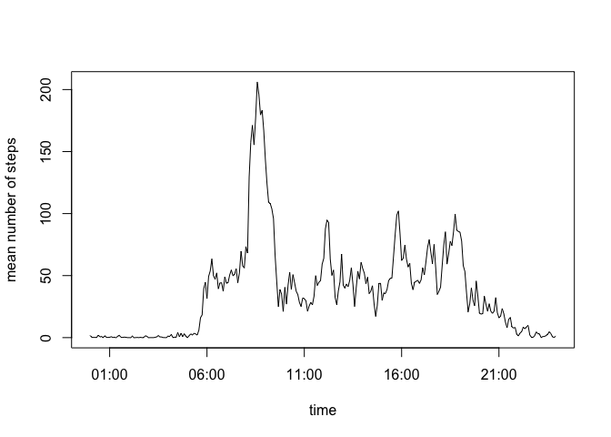
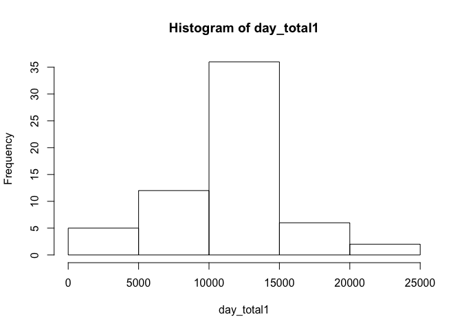
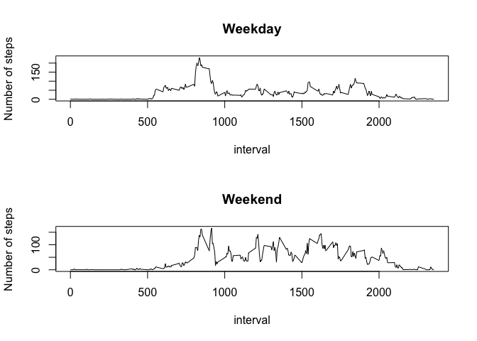

# Reproducible Research: Peer Assessment 1


## Loading and preprocessing the data

The data file is in the current working directory and is named "activity.csv".
Let's read the data into R data-frame object named "data":

```r
data <- read.csv("./activity.csv")
```
Quick look into the data:

```r
head(data,5)
```

```
##   steps       date interval
## 1    NA 2012-10-01        0
## 2    NA 2012-10-01        5
## 3    NA 2012-10-01       10
## 4    NA 2012-10-01       15
## 5    NA 2012-10-01       20
```
The data looks okay and doesn't need further proccessing at this stage.


## What is mean total number of steps taken per day?

Calculate the total number of steps taken per day:

```r
day_total <- tapply(data$steps,data$date,sum)
```


Make a histogram of the total number of steps taken each day.

```r
hist(day_total)
```

 


Calculate and report the mean and median of the total number of steps taken per day:
Number of steps for some days are NA, therefore those days have to be ignored when calculating the mean and median:

```r
Mean <- mean(day_total,na.rm=TRUE)
Median <- median(day_total, na.rm=TRUE)
```

mean is equal to **10766** and the median is equal to **10765**.


## What is the average daily activity pattern?

Mean of number of steps taken on each interval:

```r
int5_mean <- tapply(data$steps,data$interval,mean,na.rm = TRUE) ## is average across all days for each interval
int_mean=data.frame(int5_mean)
int_mean=cbind(as.integer(row.names(int_mean)),int_mean)
row.names(int_mean)=NULL
colnames(int_mean)=c("interval", "meanSteps")
int_mean$interval=sprintf("%04d",int_mean$interval)
int_mean$time=strptime(int_mean$interval,format="%H%M")
int_mean$timeHM=format(int_mean$time,"%H:%M")

plot(int_mean$time,int_mean$meanSteps,type="l", main="",ylab="mean number of steps",xlab="time")
```

 


Which 5-minute interval, on average across all the days in the dataset, contains the maximum number of steps?

```r
maxStepsTime=int_mean$timeHM[which(int_mean$mean==max(int_mean$mean))]
```
Answer is  **08:35**.


## Imputing missing values

1. Calculate and report the total number of missing values in the dataset (i.e. the total number of rows with NAs).

```r
NAs=sum(is.na(data$steps))
```
The Answer is: **2304**.

2. Let's fill in all of the missing values in the dataset by replacig NAs with the mean for given 5-minute interval.
We use the above calculated "int_mean" which contains mean values for each 5 min time interval.

```r
data1=data
data1=cbind(data1,matrix(int_mean$mean))
colnames(data1)=c(colnames(data),"int_mean")

data1$steps[is.na(data1$steps)]=data1$int_mean[is.na(data1$steps)]
```


```r
day_total1 <- tapply(data1$steps,data1$date,sum)
summary(day_total1)
```

```
##    Min. 1st Qu.  Median    Mean 3rd Qu.    Max. 
##      41    9819   10770   10770   12810   21190
```
Let's plot the histogram of the total number of steps taken in a day.

```r
hist(day_total1)
```

 


```r
mean1 <- mean(day_total1,na.rm=TRUE)
median1 <- median(day_total1)
```

The mean on this case is equal to **10766**, which is equal the previous one calculated with missing NAs.
The median is **10766** and slightly different than the previous one **10765**, as a result of replacing the NAs with mean values.


## Are there differences in activity patterns between weekdays and weekends?
Create a new factor variable - "dayType" in the dataset with two levels – “weekday” and “weekend” indicating whether a given date is a weekday or weekend day.

```r
dayType=weekdays(strptime(data1$date,format="%Y-%m-%d"))
dayType[dayType!="Sunday" & dayType!="Saturday"]="weekday"
dayType[dayType=="Sunday" | dayType=="Saturday"]="weekend"
data1$dayType=dayType
##head(data1)
week=tapply(data1$steps,list(data1$interval, data1$dayType),mean)

week=cbind(as.integer(rownames(week)),week)
colnames(week)=c("interval","weekday","weekend")
rownames(week)=NULL
week=data.frame(week)
##head(week)
```

Let's make plots containing a time series plot of the 5-minute interval (x-axis) and the average number of steps taken, averaged across all weekday days or weekend days (y-axis).


```r
par(mfrow=c(2,1))
plot(week$interval,week$weekday, type="l", main="Weekday", xlab="interval",ylab="Number of steps")
plot(week$interval,week$weekend, type="l", main="Weekend", xlab="interval",ylab="Number of steps")
```

 
